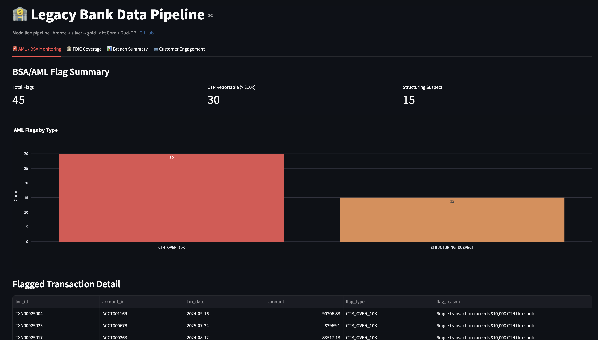
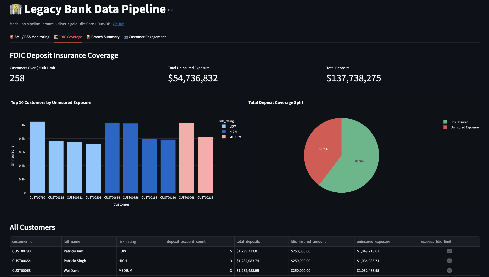
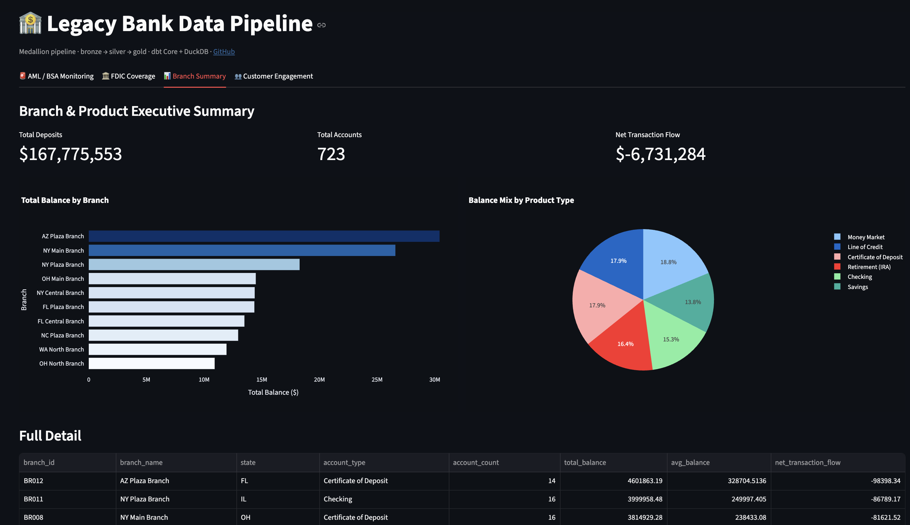
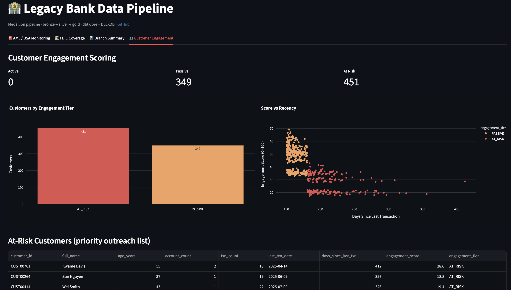
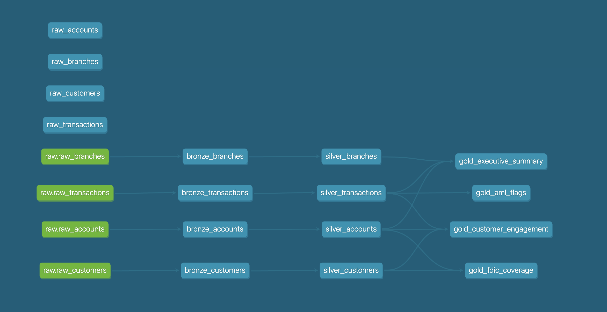

# Legacy Bank Data Migration Pipeline

[](https://github.com/jeffwilliams2/legacy-bank-data-pipeline/actions/workflows/ci.yml)


A **medallion (bronze → silver → gold)** dbt pipeline simulating a legacy core-banking migration into a modern warehouse. Produces four analytics marts covering regulatory compliance (BSA/AML, FDIC) and retail banking ops (branch performance, customer engagement), with a Streamlit dashboard on top.

Runs fully local on DuckDB — no cloud account or credentials required. The same models deploy to Snowflake by swapping one line in `profiles.yml`.

---

## Why this project

Banks run legacy PostgreSQL/Oracle core systems and are gradually migrating to cloud warehouses for regulatory reporting and analytics. I built this to demonstrate that full migration pattern end-to-end — dirty source data, compliance logic, and a reporting layer — using the same stack I work with professionally (dbt, Snowflake, Airflow, GitHub Actions).

The domain detail (CTR thresholds, structuring detection, FDIC coverage math, debit/credit sign conventions) comes from time spent at JPMorgan Chase and Charles Schwab. *(Those were client-facing roles — the engineering here is my own.)*

---

## Architecture

```
Legacy PostgreSQL              ┌─────────── dbt Core ───────────┐
(accounts, transactions,  ──▶  │  BRONZE  →  SILVER  →  GOLD     │  ──▶  Streamlit Dashboard
 customers, branches)          │  (views) (tables)   (tables)   │
        │                      └────────────────────────────────┘
   Airbyte CDC ingestion              orchestrated by Airflow
```

| Layer | Materialization | What happens |
|-------|-----------------|--------------|
| **Bronze** | Views | Raw source copy + `_loaded_at` / `_batch_id` audit columns. No business logic. |
| **Silver** | Tables | Parse 4 date formats, clean `$`/comma money strings, decode legacy account-type codes, derive signed amounts from debit/credit codes. |
| **Gold** | Tables | AML/BSA flags, FDIC coverage, customer engagement scoring, executive branch summary. |

Full design notes in [ARCHITECTURE.md](ARCHITECTURE.md).

---

## Dashboard

<p>
  
  
</p>
<p>
  
  
</p>

Four tabs reading directly from `warehouse.duckdb`:

| Tab | What it shows |
|-----|---------------|
| **AML / BSA Monitoring** | CTR-reportable transactions (>$10k) and structuring clusters flagged, with full transaction detail |
| **FDIC Coverage** | Customers exceeding the $250k insured limit, total uninsured exposure, coverage split |
| **Branch Summary** | Total deposits, account count, and net transaction flow by branch and product type |
| **Customer Engagement** | 0–100 engagement score by recency + frequency, ACTIVE / PASSIVE / AT_RISK tiers, at-risk outreach list |

```bash
pip install streamlit plotly pandas
streamlit run dashboard/app.py
```

---

## Lineage graph



Generated from the live warehouse — see [SETUP.md](SETUP.md#6-optional-generate-the-docs-site) for instructions.

---

## Gold marts

| Mart | Business question |
|------|-------------------|
| `gold_aml_flags` | Which transactions trigger a CTR (>$10k) or show structuring patterns? |
| `gold_fdic_coverage` | How much of each customer's deposits exceed the $250k FDIC limit? |
| `gold_customer_engagement` | Which customers are active, passive, or at-risk based on recency + frequency? |
| `gold_executive_summary` | Total balances, account counts, and net flow by branch and product? |

On the sample dataset: **30 CTR-reportable transactions**, **15 structuring clusters**, **14/14 data-quality tests passing**.

---

## Tech stack

| Tool | Role |
|------|------|
| **dbt Core** | All transformations across bronze / silver / gold |
| **DuckDB** | Local warehouse — zero setup, runs in-process |
| **Snowflake** | Production target — profile included, one-line swap |
| **Apache Airflow** | Orchestration DAG (`airflow/dags/`) |
| **Airbyte** | Documented CDC ingestion path from PostgreSQL |
| **Streamlit + Plotly** | Analytics dashboard over the gold layer |
| **GitHub Actions** | CI — runs `seed → run → test` on every push |

> All data is synthetic, generated by `scripts/generate_data.py` with a fixed random seed. The generator deliberately injects mixed date formats, dirty money strings, and legacy account codes — the kind of messiness that shows up in real banking exports.

---

## Quickstart

Full walkthrough in [SETUP.md](SETUP.md). Short version:

```bash
pip install dbt-duckdb
cd scripts && python generate_data.py && cd ..
export DBT_PROFILES_DIR=$(pwd)
dbt seed && dbt run && dbt test
streamlit run dashboard/app.py
```

---

## Repository layout

```
legacy-bank-data-pipeline/
├── README.md
├── ARCHITECTURE.md           ← design decisions and layer reasoning
├── SETUP.md                  ← step-by-step run guide + Snowflake swap
├── dbt_project.yml
├── profiles.yml              ← DuckDB (default) + Snowflake (commented out)
├── requirements.txt
├── models/
│   ├── bronze/               ← raw landing + audit metadata
│   ├── silver/               ← cleaned & standardized
│   └── gold/                 ← compliance and analytics marts
├── macros/                   ← date parsing, money cleaning, account code decoding
├── seeds/                    ← generated raw CSVs (the simulated legacy export)
├── scripts/
│   ├── generate_data.py      ← synthetic banking data with intentional messiness
│   └── generate_catalog.py   ← builds target/catalog.json for dbt docs site
├── dashboard/
│   └── app.py                ← Streamlit dashboard
├── docs/                     ← screenshots for README
├── airflow/
│   └── dags/                 ← example Airflow orchestration DAG
└── .github/
    └── workflows/
        └── ci.yml            ← GitHub Actions CI
```
